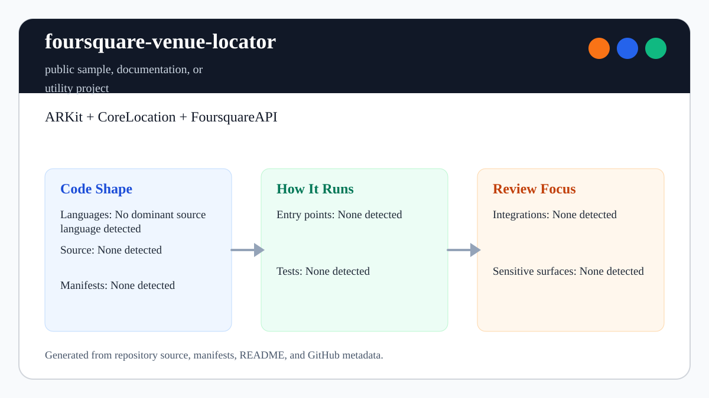

# foursquare-venue-locator

<!-- README-OVERVIEW-IMAGE -->


## Overview

`garethpaul/foursquare-venue-locator` is a documentation-only placeholder for a future ARKit, CoreLocation, and Foursquare API venue-location sample.

This README is based on the checked-in source, manifests, scripts, and repository metadata on the `master` branch. The project language mix found during review was: no dominant source language detected.

## Repository Contents

- `SECURITY.md` - security reporting and disclosure guidance
- `VISION.md` - project direction and maintenance guardrails
- `docs/plans/2026-06-08-foursquare-venue-locator-baseline.md` - current baseline plan and verification record
- `scripts/check-baseline.sh` - static validation for the checked-in documentation baseline

Additional scan context:

- Source directories: no top-level source directories detected
- Dependency and build manifests: `.env.example` only; no app dependency
  manifest detected
- Entry points or build surfaces: `make check`
- Test-looking files: `scripts/check-baseline.sh`

## Getting Started

### Prerequisites

- Git
- POSIX shell and `make` for repository validation

### Setup

```bash
git clone https://github.com/garethpaul/foursquare-venue-locator.git
cd foursquare-venue-locator
```

The setup commands above are derived from repository files. Future app work will likely require a physical-device iOS toolchain because ARKit and CoreLocation behavior cannot be fully validated in a static repository scan.

## Running or Using the Project

- No app runtime is checked in yet. Start with the repository baseline:

```bash
make lint
make test
make build
make check
```

- The docs-only baseline must be updated before app source, Xcode projects, or
  dependency manifests are added.

## Testing and Verification

- `make lint`, `make test`, `make build`, and `make check` validate the current
  documentation, privacy, and credential guardrails. The `lint`, `test`, and
  `build` targets currently delegate to the static baseline so the repository
  has a consistent local gate before app code exists.
- GitHub Actions runs the same boundary checks for pushes and pull requests
  with read-only permissions and no persisted checkout credentials.

When the required SDK or runtime is unavailable, use static checks and source review first, then verify on a machine that has the matching platform toolchain.

## Configuration and Secrets

- `.env.example` contains placeholder values and exactly two plain placeholder assignments
  for future local Foursquare configuration and remains non-executable. Copy it
  to `.env` for local experiments and keep real values out of git.
- Local direnv files such as `.envrc` are ignored because they can export real
  Foursquare credentials or machine-specific settings.
- Local Xcode build-setting files such as `*.xcconfig` are ignored because they
  can contain Foursquare credentials, signing settings, or machine-specific
  paths.
- Future Foursquare settings should use local-only names such as
  `FOURSQUARE_CLIENT_ID` and `FOURSQUARE_CLIENT_SECRET`; do not commit real
  values, generated config, or API query strings that include credentials.
- Future iOS app targets should include clear `NSLocationWhenInUseUsageDescription` and `NSCameraUsageDescription` purpose strings before any ARKit, CoreLocation, or camera code is added.
- Future implementation changes should add device verification notes and
  dependency manifests in the same change that introduces app source.
- Future Apple signing artifacts, provisioning profiles, archives, IPA exports,
  Xcode result bundles, and private key containers (`.p8`, `.pfx`, `.pem`, and
  `.key`) are ignored and must stay out of git.
- Future Xcode user-state files and workspace user data are ignored and must
  stay out of git.
- Future GPX, GeoJSON, KML, and local location-trace folders are treated as
  local test data unless the baseline is deliberately updated for sanitized
  fixtures.
- Future `camera-captures` and `camera-recordings` directories are local-only
  outputs. Intentionally sanitized media fixtures require an explicit baseline
  update and metadata review before they are tracked.

## Security and Privacy Notes

- The scan did not identify production authentication, payment, or secret-management code. Treat future additions in those areas as security-sensitive.
- Treat location permission prompts, camera access, venue search URLs, and any
  saved location traces as security-sensitive surfaces.
- Treat Apple signing artifacts and export archives as sensitive local files,
  not project documentation or source.
- Treat App Store Connect, signing, and TLS private key containers and block
  material as local secrets that must never be tracked.
- Treat `.envrc` as a local credential file when using direnv or similar
  tooling.
- Treat `*.xcconfig` files as local build settings unless a future app baseline
  explicitly documents sanitized checked-in configuration.
- Treat Xcode user-state files as local machine artifacts because they can
  include personal workspace paths or device state.
- Treat local location traces and simulator routes as sensitive test inputs
  because they can reveal precise movement patterns.
- Treat local AR camera captures and recordings as sensitive outputs because
  they can reveal people, private spaces, and embedded location metadata.

## Maintenance Notes

- Keep `.github/workflows/check.yml` aligned with the docs-only baseline.
- See `docs/plans/2026-06-10-hosted-boundary-checks.md` for hosted enforcement.
- See `SECURITY.md` for vulnerability reporting and safe research guidance.
- See `VISION.md` for project direction and contribution guardrails.
- See `docs/plans/2026-06-09-foursquare-venue-ios-privacy-keys.md` for the
  future iOS privacy-key baseline.
- See `docs/plans/2026-06-09-foursquare-venue-implementation-boundary.md` for
  the docs-only implementation boundary.
- See `docs/plans/2026-06-09-foursquare-venue-local-config-template.md` for
  the local configuration template guardrail.
- See `docs/plans/2026-06-09-foursquare-venue-envrc-guard.md` for the local
  direnv credential-file guardrail.
- See `docs/plans/2026-06-09-foursquare-venue-xcconfig-guard.md` for local
  Xcode build-setting guardrails.
- See `docs/plans/2026-06-09-foursquare-venue-signing-artifact-guard.md` for
  Apple signing and export artifact exclusions.
- See `docs/plans/2026-06-09-foursquare-venue-location-trace-guard.md` for
  location trace and simulator route exclusions.
- See `docs/plans/2026-06-09-foursquare-venue-make-gate-aliases.md` for local
  verification target guardrails.
- See `docs/plans/2026-06-09-foursquare-venue-xcode-user-state-guard.md` for
  Xcode user-state artifact exclusions.

## Contributing

Keep changes small and tied to the project that is already present in this repository. For code changes, document the toolchain used, avoid committing generated dependency directories or local configuration, and update this README when setup or verification steps change.
